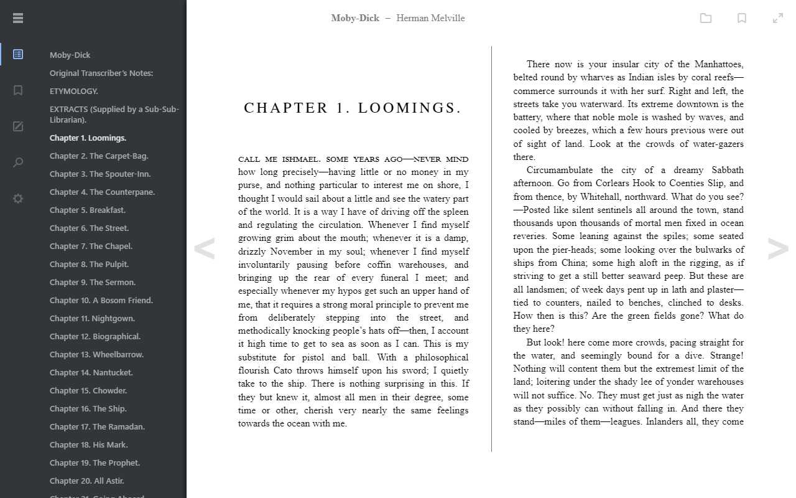

# epubreader-js



## About the Reader

The **epubreader-js** application is based on the [epub.js](https://github.com/futurepress/epub.js) library and is a fork of the [epubjs-reader](https://github.com/futurepress/epubjs-reader) repository.

## Getting Started

Open up [epubreader-js](https://intity.github.io/epubreader-js/) in a browser.

You can change the ePub it opens by passing a link to `bookPath` in the url:

`?bookPath=https://s3.amazonaws.com/epubjs/books/alice.epub`

## Running Locally

Install [node.js](https://nodejs.org/en/)

Then install the project dependences with npm

```javascript
npm install
```

You can run the reader locally with the command

```javascript
npm run serve
```

Builds are concatenated and minified using [webpack](https://github.com/webpack/webpack)

To generate a new build run

```javascript
npm run build
```

or rebuilding all *.js files

```javascript
npm run prepare
```

## Pre-configuration

The **epubreader-js** application settings is a JavaScript object that you pass as an argument to the `main` function. By default, initialization of **epubreader-js** application settings is performed at the `Reader` class level. However, a simpler solution is to do pre-configuration in the [index.html](dist/index.html) file. For example, this is what a call to the `main` function looks like:

```html
<script type="text/javascript">
    const url = new URL(window.location)
    const path = url.searchParams.get("bookPath") || "https://s3.amazonaws.com/moby-dick/"
    window.onload = (e) => {
        epubreader.main(path)
    }
</script>
```

Let's say we want to disable the openbook function, which is designed to open an epub file on a personal computer. This can be useful for integrating a public library into your site. Let's do this:

```html
<script type="text/javascript">
    const url = "{{bookPath}}"
    window.onload = (e) => {
        epubreader.main(url, {
            openbook: false
        })
    }
</script>
```

> Note that the `{{bookPath}}` replacement token is used to define the `url` string variable. This simple solution will allow you to set up a route to pass the target URL.

## Features

The **epubreader-js** application supports the following features:

- Initial support for mobile devices
- Saving settings in the browser’s local storage
- Opening a book file from the device’s file system
- Bookmarks
- Annotations
- Search by sections of the book
- Output epub metadata
- Keybindings
